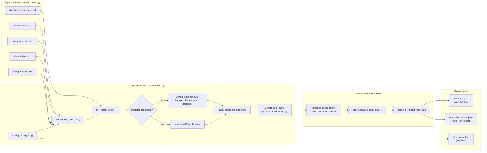
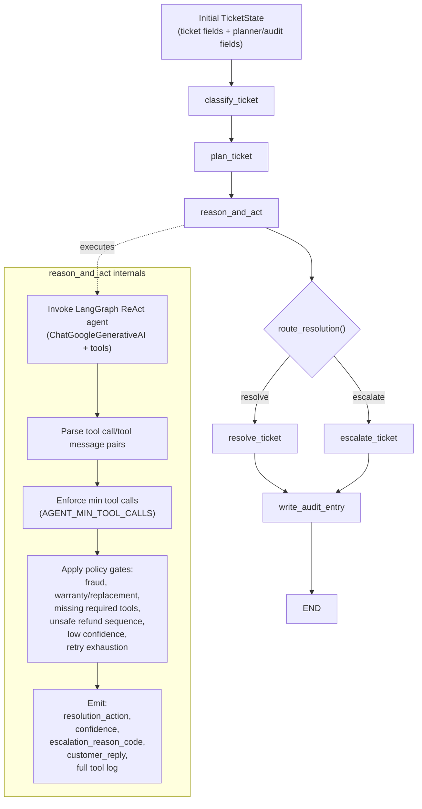
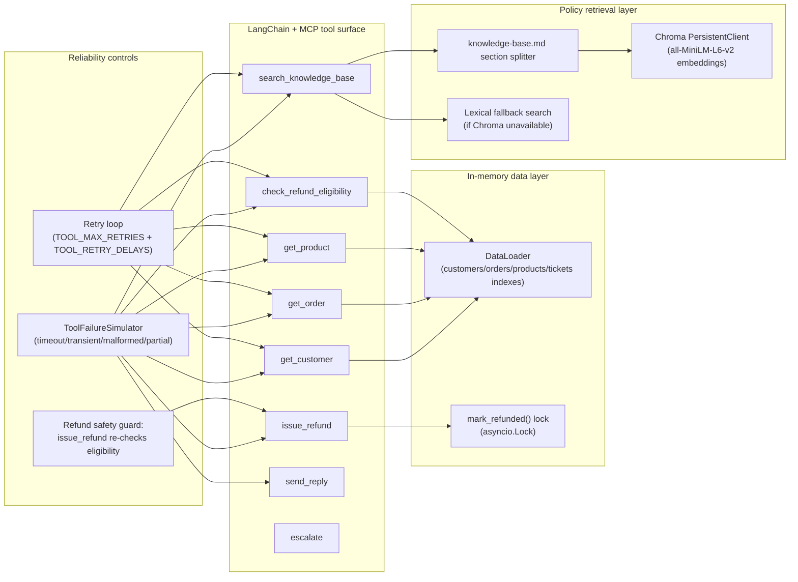

# ShopWave Agent Architecture (Detailed)

## 1. System/runtime architecture

## 2. Per-ticket LangGraph flow

## 3. Tool and policy/data architecture

## 4. Key architecture behaviors captured by this design

- **Concurrency:** all tickets are processed concurrently with a semaphore cap (`AGENT_CONCURRENCY_LIMIT`).
- **Durability:** graph state is checkpointed in PostgreSQL when available, with in-memory fallback.
- **Policy-first planning:** `plan_ticket` derives expected tool chain and escalation intent before ReAct execution.
- **Defense-in-depth:** refund issuance is guarded both by planning rules and internal `issue_refund` eligibility re-check.
- **Traceability:** every tool call attempt (including retries/failures) is recorded and emitted to `audit_log.json`.

