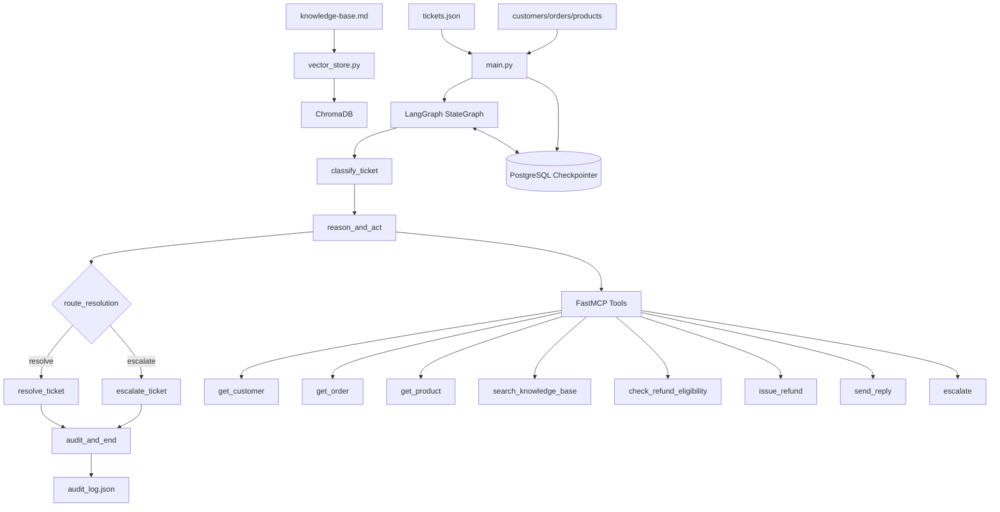

# ShopWave Agent Architecture

## Notes

- Ticket workers run concurrently with `asyncio.gather` + `Semaphore`.
- Each graph run uses a unique `thread_id` for checkpoint continuity.
- Every tool call attempt is audit-tracked with retries, duration, and error detail.

